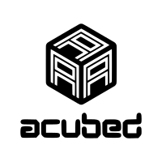

<div align="center">
    <picture>
        <source srcset="assets/logo/dark-mode/acubed.png"  media="(prefers-color-scheme: dark)">
        
    </picture>
</div>

[](https://img.shields.io/github/v/release/stepmanai/ACubed)
[](https://github.com/stepmanai/ACubed/actions/workflows/main.yml?query=branch%3Amain)
[](https://codecov.io/gh/stepmanai/ACubed)
[](https://img.shields.io/github/commit-activity/m/stepmanai/ACubed)
[](https://img.shields.io/github/license/stepmanai/ACubed)

A model training framework for building stepfile difficulty prediction models for open source rhythm games.

- **Github repository**: <https://github.com/stepmanai/ACubed/>
- **Documentation** <https://stepmanai.github.io/ACubed/>

- **Datasets**: <https://huggingface.co/datasets/stepmanai/ffr_charts>

## Prerequisites:

Based on [Copier's installation requirements](https://github.com/copier-org/copier?tab=readme-ov-file#installation), this project is natively supported on `Ubuntu 22.04` (`ubuntu:jammy`) and later versions.

For Windows users, you can download `Ubuntu 22.04` from the Microsoft Store after setting up Windows Subsystem for Linux (WSL). Instructions provided [here](https://learn.microsoft.com/en-us/windows/wsl/install).

> **Note**: The following instructions assume you have access to this repository. If you need to request access, please contact us.

## Getting Started with Your Project

### 1. ✅ Setup SSH Keys in GitHub and Hugging Face

Make sure you have a single SSH key configured for both platforms:

<details>
<summary>Click to expand SSH key setup steps</summary>

```bash
# Generate a new SSH key (if you don't have one)
ssh-keygen -t ed25519 -C "your_email@example.com"

# Add the key to your SSH agent
eval "$(ssh-agent -s)"
ssh-add ~/.ssh/id_ed25519
# Copy the public key to clipboard
cat ~/.ssh/id_ed25519.pub

```

</details>

- **GitHub:** [Add SSH Key](https://github.com/settings/keys)

- **Hugging Face:** [Add SSH Key](https://huggingface.co/settings/keys)

You can verify SSH setup with:

```bash
ssh -T git@github.com
ssh -T git@hf.co
```

### 2. Clone the Repository to Your Local Environment

Begin by cloning the repository to a specific location on your local machine.

```bash
git clone git@github.com:stepmanai/ACubed.git
cd ACubed
```

### 3. Install Required Local Dependencies

Next, install the necessary dependencies by executing the following commands:

> **Note**: You may skip some of these if they are already installed on your machine.

```bash
sudo apt update
sudo apt install -y make python3-pip jq git-lfs
```

### 4. Install `uv`

```bash
wget -qO- https://astral.sh/uv/install.sh | sh
source $HOME/.local/bin/env
```

### 5. Initialize `git lfs`

```bash
curl -s https://packagecloud.io/install/repositories/github/git-lfs/script.deb.sh | sudo bash
git lfs install
```

### 6. Set Up Your Development Environment

Finally, set up your development environment and install pre-commit hooks with:

```bash
make install
```

### 7. Test pre-commit hooks

Verify that the checks in the pre-commit hooks does not fail by running the following command:

```bash
uv run pre-commit run -a
```

### 8. Initialize Visual Studio Code

Run the following command to open up a code editor:

```bash
code .
```

You are now ready to start development on your project!

Each time when code changes are made in the repository, run the pre-commit hooks to make sure that the build passes before opening a pull request, merging to main, or creating a new release. The project is designed so that the CI/CD pipeline will run these above code quality checks to enforce standardization.

To finalize the set-up for publishing to PyPI, see [here](https://fpgmaas.github.io/cookiecutter-uv/features/publishing/#set-up-for-pypi).
For activating the automatic documentation with MkDocs, see [here](https://fpgmaas.github.io/cookiecutter-uv/features/mkdocs/#enabling-the-documentation-on-github).
To enable the code coverage reports, see [here](https://fpgmaas.github.io/cookiecutter-uv/features/codecov/).

## Releasing a new version

- Create an API Token on [PyPI](https://pypi.org/).
- Add the API Token to your projects secrets with the name `PYPI_TOKEN` by visiting [this page](https://github.com/stepmanai/ACubed/settings/secrets/actions/new).
- Create a [new release](https://github.com/stepmanai/ACubed/releases/new) on Github.
- Create a new tag in the form `*.*.*`.

For more details, see [here](https://fpgmaas.github.io/cookiecutter-uv/features/cicd/#how-to-trigger-a-release).

---

Repository created by [stepmanai/project-bass](https://github.com/stepmanai/project-bass).

Repository structure based on [fpgmaas/cookiecutter-uv](https://github.com/fpgmaas/cookiecutter-uv).
