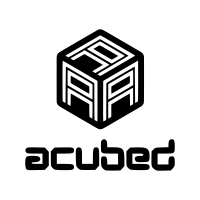

<div align="center">
    <picture>
        <source srcset="assets/logo/dark-mode/acubed.png"  media="(prefers-color-scheme: dark)">
        
    </picture>
</div>

[](https://img.shields.io/github/v/release/stepmanai/ACubed)
[](https://github.com/stepmanai/ACubed/actions/workflows/main.yml?query=branch%3Amain)
[](https://codecov.io/gh/stepmanai/ACubed)
[](https://img.shields.io/github/commit-activity/m/stepmanai/ACubed)
[](https://img.shields.io/github/license/stepmanai/ACubed)

A time series extrinsic regression model built to objectively measure stepfile difficulty in community-based vertical scroll rhythm games.

- **Github repository**: <https://github.com/stepmanai/ACubed/>
- **Documentation** <https://stepmanai.github.io/ACubed/>

## Prerequisites:

This project is compatible with `Ubuntu 22.04` (`ubuntu:jammy`) or later supported versions.

For older versions (`ubuntu:focal` or earlier), you must manually install `Python 3.9` or later.

> **Note**: These instructions assume you have access to this repository. If you need to request access, please contact us.

## Getting Started with Your Project

### 1. Clone the Repository to Your Local Environment

Begin by cloning the repository to a specific location on your local machine.

```bash
git clone https://github.com/stepmanai/ACubed.git
```

### 2. Install Required Local Dependencies

Next, install the necessary dependencies by executing the following commands:

> **Note**: You may skip some of these if they are already installed on your machine.

```bash
sudo apt install make python3-pip
pip install uv
```

### 3. Set Up Your Development Environment

Finally, set up your development environment and install pre-commit hooks with:

```bash
make install
```

### 4. Test pre-commit hooks

Verify that the checks in the pre-commit hooks does not fail by running the following command:

```bash
uv run pre-commit run -a
```

You are now ready to start development on your project!

Each time when code changes are made in the repository, run the pre-commit hooks to make sure that the build passes before opening a pull request, merging to main, or creating a new release. The project is designed so that the CI/CD pipeline will run these above code quality checks to enforce standardization.

To finalize the set-up for publishing to PyPI, see [here](https://fpgmaas.github.io/cookiecutter-uv/features/publishing/#set-up-for-pypi).
For activating the automatic documentation with MkDocs, see [here](https://fpgmaas.github.io/cookiecutter-uv/features/mkdocs/#enabling-the-documentation-on-github).
To enable the code coverage reports, see [here](https://fpgmaas.github.io/cookiecutter-uv/features/codecov/).

## Releasing a new version

- Create an API Token on [PyPI](https://pypi.org/).
- Add the API Token to your projects secrets with the name `PYPI_TOKEN` by visiting [this page](https://github.com/stepmanai/ACubed/settings/secrets/actions/new).
- Create a [new release](https://github.com/stepmanai/ACubed/releases/new) on Github.
- Create a new tag in the form `*.*.*`.

For more details, see [here](https://fpgmaas.github.io/cookiecutter-uv/features/cicd/#how-to-trigger-a-release).

---

Repository initiated with [stepmanai/base-template](https://github.com/stepmanai/base-template) and pre-created by [fpgmaas/cookiecutter-uv](https://github.com/fpgmaas/cookiecutter-uv).
